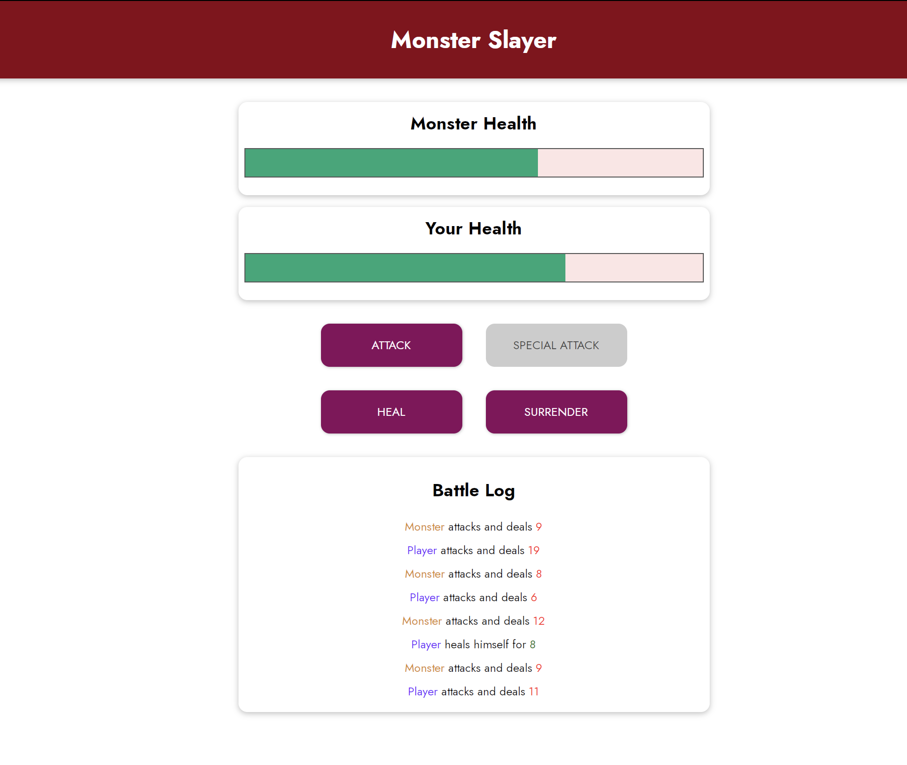
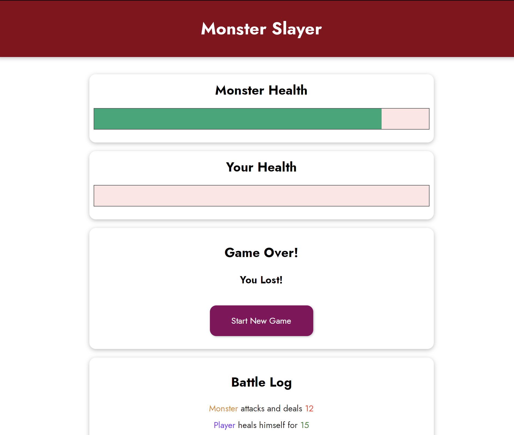

# The "Monster Slayer" Game
 A game running in the browser, 100% powered by Vue
 
 Exploring
 

 How to Output Reactive Data & Listen to Events ?

 Interacting with DOM (Rendering Lists, Conditionally attaching/ detaching Elements ...)
 

 

 